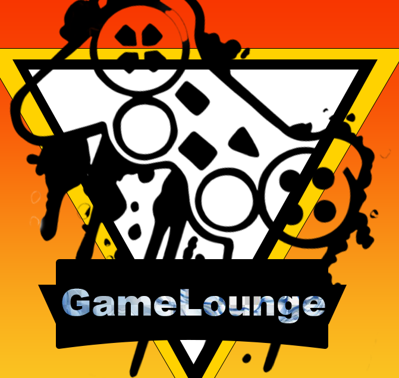

# <p align="center"> Game Lounge </p>
br>
<br>

## About this project 📝
<hr>
  Game Lounge is a blog page simliar to Reddit. Its a place where users can chat about anything related to games!!!
<br>
<br>
<br>
<br>

## languages Used and technology 💻
<hr>
<br>

<br>


## Code snipets
<hr>


<p> This is the api component that calls the objects of players in adds them to the player list. This is where we get the player card information. 
<br>

``` <div class="container">
                    <div class="row">
                        <div class="col-lg-8 col-md-8">
                            <% for( let index = 0; index < formattedRecords.length; index++ ) { %>
                            <!-- POST -->
                            <div class="post">
                                <div class="wrap-ut pull-left">
                                    <div class="userinfo pull-left">
                                        <div class="avatar">
                                            
                                            <p><%= formattedRecords[index].username %> </p>
                                            <div class="status green">&nbsp;</div>
                                        </div>
                                   </div>
```

<br>
<br>

## Challenges Faced
<hr>
This was suppose to be a 2-4 pearson team project. Things happen so this turned into a one person project. This was changelling doing the backend and the frontend.
<br>
<br>
<br>
<br>


## Authors
<hr>

  [LaQuinta Williams](https://github.com/willarmy20)
  [Matthew Fisher]- Contributor
<br>
<br>
